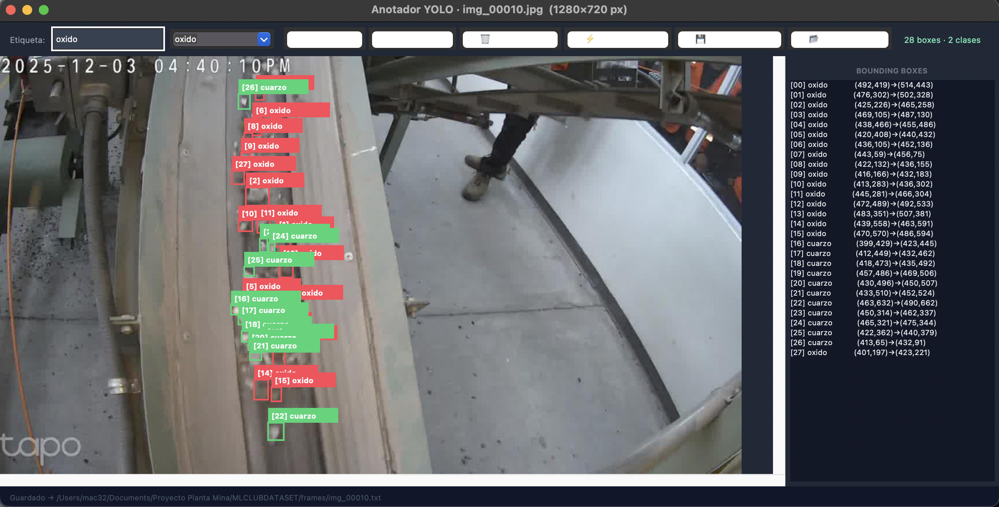

## Project Overview

This project examines the feasibility of applying computer vision and artificial intelligence techniques
for the visual detection and classification of minerals—specifically oxides, sulfides, and silica—based
on images acquired under real-world operational conditions.

The proposed approach does not aim to replace conventional mineralogical analysis methods; instead,
it investigates the potential of deep learning models as auxiliary tools capable of delivering
preliminary visual insights that complement established technical procedures.

To this end, a rigorous methodological workflow is proposed, encompassing:

<ul>
    <li>Real data acquisition under operational conditions</li>
    <li>Collaborative dataset curation</li>
    <li>Expert-driven data labeling</li>
    <li>Supervised model training</li>
    <li>Critical evaluation of the model’s performance and limitations</li>
</ul>

Read the paper for more information (ML_Beeck.pdf)

**Expert-driven data labeling** is performed manually using a graphical user interface (UI) that allows drawing **bounding boxes** around mineral instances (oxides, sulfides, silica, etc.) in each image. Labels are assigned according to the defined classes, and annotations are exported directly in **YOLO format** (`.txt` files with normalized center-x, center-y, width, height per line).

This format is compatible with most YOLO implementations (YOLOv5, YOLOv8, etc.) and ensures precise object detection training.

Source code: Etiquetador.py

### Labeling UI-APP

Here is the screenshot showing the manual bounding box labeling and export to YOLO format:

  

